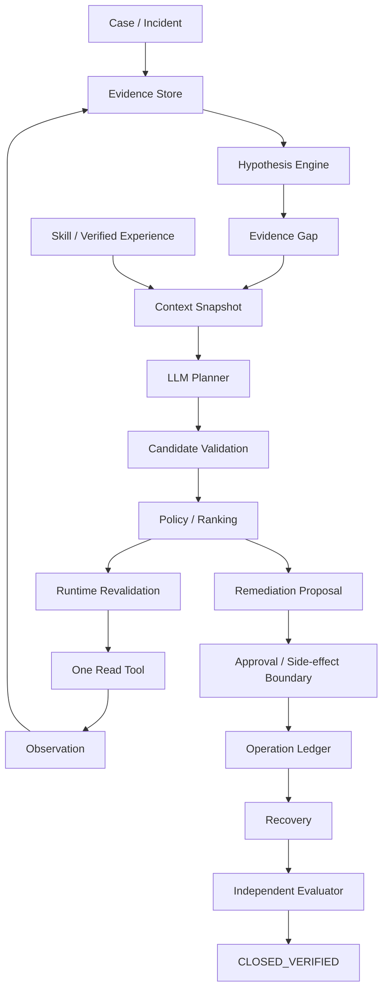

# Credit Incident Resolution Agent Harness

面向金融异常调查场景的 **Agent Harness 脱敏实现**。

项目来源于真实金融生产支持工作中的一类典型问题：一笔订单在资产方、担保方、资金方及支付、回调、消息、账务等系统中可能呈现不同状态，人工需要跨系统查证、判断“现在到底知道什么、还缺什么、下一步应该查哪里”，并在结果不确定时避免错误重试和错误关单。

本仓库重点展示的不是“让 LLM 直接操作金融系统”，而是如何把模型限制在一个可控的 Harness 中：

> **模型负责提出下一步调查建议；确定性后端负责证据、工具权限、执行边界、恢复与最终验收。**

---

## 1. 项目解决什么问题

典型异常可能同时出现：

- 原请求 HTTP Timeout；
- 资金方查询返回 `SUCCESS`；
- 本地订单仍处于处理中；
- Callback 表没有业务记录；
- MQ 消费异常；
- 账务或还款计划尚未收敛。

这些现象不能直接推出最终业务结论：

- `TIMEOUT` 不等于失败；
- `NOT_FOUND` 不等于业务从未发生；
- 某个系统 `SUCCESS` 不等于其他业务域已经完成；
- Tool 返回成功不等于 Case 可以关闭。

因此项目将一次异常调查拆成：

```text
Case
  ↓
Observation
  ↓
Evidence
  ↓
Hypothesis
  ↓
Evidence Gap
  ↓
Context Snapshot
  ↓
Planner
  ↓
Candidate Validation / Policy
  ↓
One Tool
  ↓
New Observation / Evidence
  ↺
```

当调查进入受控处理阶段后，副作用、恢复和最终验收仍由独立的确定性边界负责。

---

## 2. 核心设计

### 2.1 Observation != Evidence

Tool 的原始返回先保存为 Observation，再由后端确定性逻辑提取 Evidence。

模型不能自由把：

```text
资金状态 = SUCCESS
```

扩展解释成：

```text
整笔业务已经最终成功
```

相同 Observation 应得到相同 Evidence，避免金融事实随着模型、Prompt 或表达风格变化。

---

### 2.2 UNKNOWN 是显式安全状态

项目允许 UNKNOWN 长期存在。

例如：

```text
请求超时
→ 不知道外部效果是否已经发生
→ 保持 UNKNOWN
→ 查询原业务结果
```

而不是：

```text
请求超时
→ 当成失败
→ 再执行一次
```

---

### 2.3 Hypothesis 与 Evidence Gap 分离

Hypothesis 表示“当前可能是什么问题”。

Evidence Gap 表示“为了区分这些可能，还缺什么事实”。

Gap 描述的是缺失事实，不直接绑定某个 Tool，因此可以在不同系统、版本和权限条件下映射到不同调查能力。

---

### 2.4 Context 每轮重建

Planner 不依赖不断增长的 Chat History。

每轮从持久化的 Case、Evidence、Hypothesis、Gap、Tool 能力、策略和少量历史 Guidance 重新构建 Context Snapshot。

这样可以：

- 避免旧上下文覆盖新事实；
- 支持 Worker 重启；
- 接受人工或其他任务对 Case 的最新更新；
- 控制 Token Budget；
- 对关键事实保持可追溯引用。

---

### 2.5 Planner 只有建议权，没有执行权

Planner 输出结构化候选动作，不直接执行 Tool。

候选还需要经过：

- Schema Validation；
- Tool Allowlist；
- Case Scope；
- Permission；
- Budget；
- Hard Policy；
- Deterministic Ranking；
- Runtime Revalidation；
- Version / CAS。

模型“想调用一个 Tool”不等于系统允许执行。

---

### 2.6 每轮最多执行一个调查 Tool

调查阶段每轮只执行一个经过校验的只读 Tool。

原因是新 Tool Result 会形成新的 Evidence，而新的 Evidence 会改变下一步决策。

```text
Tool A
→ New Evidence
→ 原本计划的 Tool B / C 可能已经没有必要
→ 重新规划
```

项目刻意不把“模型一次想到的所有查询”直接批量执行。

---

### 2.7 Retry != Recovery

对于已经跨过发送边界、结果不确定的副作用：

```text
DISPATCHED
→ TIMEOUT
→ UNKNOWN
→ 查询原 Operation
→ 根据真实结果恢复
```

而不是重新创建一个等价业务动作。

Recovery 使用持久化 Operation、Lease / Fencing、Backoff 和查询原效果等机制处理不确定状态。

---

### 2.8 APPLIED != VERIFIED

操作已经应用，不代表业务已经真正恢复。

Independent Evaluator 会基于当前持久 Evidence、身份关联、状态、操作结果和业务 Outcome 进行独立验收。

只有新的、仍然有效的 PASS 通过 Closure CAS 后，Case 才能进入：

```text
CLOSED_VERIFIED
```

Planner、模型自述、Tool SUCCESS、Operation APPLIED 都不能直接关闭 Case。

---

### 2.9 历史经验只能影响策略，不能成为当前事实

项目支持 Skill / Verified Experience Memory。

检索链路采用：

```text
结构化硬过滤
→ PostgreSQL + pgvector 召回
→ 确定性重排
→ 有界注入 Context
```

历史经验可以帮助 Planner 选择调查方向，但不能：

- 替代当前 Evidence；
- 获得 Tool 权限；
- 参与业务真相认定；
- 直接决定关单。

---

## 3. 整体架构



---

## 4. 主要能力

当前仓库已经实现并验证的主要能力包括：

- Case Runtime 与持久化生命周期；
- Observation / Evidence / Provenance；
- 确定性 Hypothesis Engine；
- Evidence Gap；
- Context Snapshot 与 Token Budget；
- LLM Planner + Structured Output；
- Tool Registry、Allowlist、Policy、Ranking；
- Runtime Revalidation 与数据库 CAS；
- 单 Tool 调查循环；
- Remediation Proposal 与确定性预检；
- Side-effect Boundary；
- Durable Recovery；
- Independent Evaluator；
- Verified Closure；
- Skill Library / Verified Experience Memory；
- PostgreSQL + pgvector Hybrid Retrieval；
- Durable Case Orchestration；
- System Registry / Route Revision；
- Investigation & Trace Console；
- Production Operations / Release Verification。

---

## 5. 为什么不用一个普通 ReAct / LangGraph Workflow

这个项目不是为了否定 Workflow。

对于已经明确、稳定、可编码的路径，例如固定补偿或已知回调恢复，传统程序和 Workflow 更合适。

Agent 的价值只放在：

> **调查路径会随着 Observation 动态变化、接单时无法提前写死完整步骤的长尾异常。**

因此核心金融事实、权限、执行、安全、恢复和关单仍然保持确定性实现。

本仓库不以 LangGraph、CrewAI、AutoGen 作为核心 Runtime。

---

## 6. 技术栈

- Python 3.11+
- FastAPI
- Pydantic
- SQLAlchemy
- PostgreSQL
- pgvector
- Alembic
- pytest
- React + TypeScript
- Ant Design
- React Flow

可选接入 OpenAI Structured Outputs；默认测试和大部分 Demo 可使用 Fake Planner 离线运行。

---

## 7. 快速开始

### 安装

```bash
python -m venv .venv
source .venv/bin/activate   # Windows: .venv\Scripts\activate

pip install -e ".[test]"
```

### 运行测试

```bash
pytest
```

### 体验调查循环

```bash
python scripts/demo_agent_loop.py --scenario S6 --provider fake
```

### 体验 Recovery

```bash
python scripts/demo_recovery.py --scenario read-orphan
```

### 体验 Independent Evaluator

```bash
python scripts/demo_evaluator.py --scenario s6-converged
```

### 体验历史经验检索

```bash
python scripts/demo_memory.py --output .local/memory-demo.json
```

---

## 8. 文档导航

| 主题 | 文档 |
|---|---|
| Case / Evidence | [docs/case-evidence.md](docs/case-evidence.md) |
| Hypothesis Engine | [docs/hypothesis-engine.md](docs/hypothesis-engine.md) |
| Context Engineering | [docs/reasoning-context.md](docs/reasoning-context.md) |
| Planner | [docs/planner.md](docs/planner.md) |
| Agent Runtime | [docs/agent-runtime.md](docs/agent-runtime.md) |
| Remediation Boundary | [docs/remediation-boundary.md](docs/remediation-boundary.md) |
| Side-effect Boundary | [docs/side-effect-boundary.md](docs/side-effect-boundary.md) |
| Durable Recovery | [docs/recovery.md](docs/recovery.md) |
| Independent Evaluator | [docs/evaluator.md](docs/evaluator.md) |
| Organizational Memory | [docs/organizational-memory.md](docs/organizational-memory.md) |
| Hybrid Retrieval | [docs/hybrid-vector-retrieval.md](docs/hybrid-vector-retrieval.md) |
| Durable Orchestration | [docs/orchestration.md](docs/orchestration.md) |
| System Registry | [docs/system-registry.md](docs/system-registry.md) |
| Investigation Console | [docs/ui-console.md](docs/ui-console.md) |
| Benchmark / Eval | [docs/benchmark.md](docs/benchmark.md) |
| Production Operations | [docs/production-operations.md](docs/production-operations.md) |

---

## 9. 项目边界

这是一个基于真实金融异常调查模式抽象出来的脱敏实现。

公开仓库：

- 不连接真实银行、资产平台、支付系统或客户数据；
- 不提供任意 SQL、生产 Shell 或任意 HTTP 能力；
- 不让模型直接修改核心金融数据；
- Simulator / synthetic fixture 只用于复现 Harness 行为与安全边界；
- 离线 Benchmark 不能直接代表真实生产模型收益；
- 不声称跨系统无条件 Exactly Once；
- 不用模型自评代替业务验收。

仓库重点展示的是：

> **如何把不确定的 LLM 推理，放进一个证据驱动、权限受控、可恢复、可审计、可独立验收的生产型 Agent Harness。**

---

## 10. Repository Structure

```text
src/credit_harness/
├── agent/          # Planner、Context、Hypothesis、Agent Loop
├── runtime/        # Policy、Budget、Worker、Recovery、Orchestration
├── tools/          # Tool Contract、Registry、Query / Action Boundary
├── evaluator/      # Independent Evaluator / Verified Closure
├── persistence/    # PostgreSQL、Repository、Operation Ledger
├── simulator/      # Synthetic World / Fault Injection
├── observability/  # Timeline / Trace
└── api/            # FastAPI

tests/
├── unit/
├── integration/
├── safety/
├── recovery/
├── acceptance/
└── agent_evals/

docs/
└── 详细设计文档
```

---

## 11. 适合关注的几个问题

如果你在看这个项目，建议重点思考：

1. 为什么 Tool Result 不能直接作为业务真相？
2. 为什么 UNKNOWN 是一个必要状态？
3. 为什么 Gap 不直接写成 Tool Name？
4. 为什么 Planner 没有 Tool 权限？
5. 为什么调查阶段一轮只执行一个 Tool？
6. 为什么 Planner 校验完，执行前还要再次 Revalidation？
7. 为什么有幂等仍然需要 Recovery？
8. 为什么 APPLIED 还不能 Close？
9. 为什么历史 Experience 不能成为当前 Evidence？
10. 如何证明 Agent 真正比固定 Workflow 更适合某类长尾调查？

这也是本项目最主要的工程价值所在。
