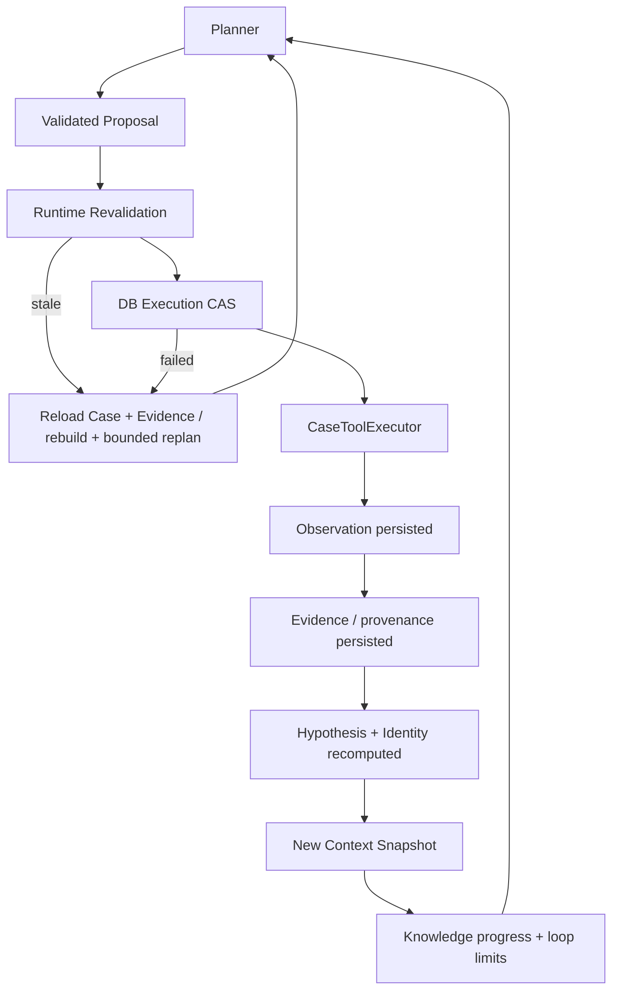

# Step 6 — Autonomous Read-only Investigation Runtime

`InvestigationAgentRuntime.run(case_id)` 把 Planner 选中建议接到受控只读查询。每轮从数据库 Case + Evidence 重建 Context；模型不获取 Tool Response、历史对话、Oracle 或上游 credential。所有数据仍是 synthetic fixtures。默认离线 Fake 验证执行契约，不代表真实 LLM 推理质量已通过验收。

## 模块与依赖

```text
agent/
  models.py          # Run / Turn / Attempt / Revalidation / KnowledgeProgress
  runtime.py         # 有界循环、可信服务依赖注入
  revalidation.py    # 当前 Snapshot / Case / Policy 的纯校验
  query.py           # 显式重建 ToolQuery
  progress.py        # 语义知识变化，不以 budget/hash 变化冒充进展
  trace.py           # append-only 内存 Trace Store Protocol / implementation
cases/preconditions.py              # DB CAS 前置条件；不依赖 agent/planner
adapters/investigation_fake.py       # 仅依据 ModelInputBundle 的离线建议模型
scripts/demo_agent_loop.py           # synthetic provisioning + HTTP demo
tests/test_agent_runtime.py          # 执行、并发、错误、身份、停止与架构边界
```

Runtime 注入 CaseRepository / EvidenceRepository / ReasoningContextAssembler / PlannerService / CaseToolExecutor，构造器检查共享 tenant、engine 与执行器仓库。没有直接网络、Tool Client、SimulatorAdmin、SQL、Vault 或 Evaluator 依赖。Planner 不反向依赖 Agent。`run(case_id)` 是可信应用服务入口，本次没有新增 HTTP 运行端点或改变 UI-0。



## 每 Turn 生命周期

1. Reload Case + Evidence，Assembler 重算 Hypothesis、Identity、Gap 与 Snapshot。
2. PlannerService 消费 Snapshot；Renderer 按信任分区与 alias 投影，模型提出候选，Validator / HardPolicy / Ranker 选择一个或返回 null。
3. 再次 Reload + rebuild **fresh Snapshot**，验证选中建议。
4. CALL_TOOL 重新构造 ToolQuery，进入 `CaseToolExecutor.execute_if_current(..., precondition=...)`。预算预留与 CaseCall 创建先通过 DB CAS，之后才调用 HTTP Tool。
5. 既有链路持久化 Observation、验证 dispatch correlation、提取并持久化 Evidence。Runtime 不使用 receipt.observation 推理，只记录 call_id / evidence_refs。
6. 再次 Reload + rebuild，比较知识变化、记录 Trace、检查停止条件，然后进入下一轮。

一个 Turn 最多执行一个查询。`valid_candidates` 是审计数据，不能遍历执行；获得新 Evidence 后必须重做规划，不能执行旧候选列表。`selected_action=None` 立即 SAFE_NO_ACTION，不合成任何 fallback Tool。

## Proposal 不是授权：TOCTOU 与 Revalidation

规划与执行之间可能出现预算被其他调用消耗、人工暂停、晚到结果提交 Evidence 或策略升级。`RuntimeActionRevalidator.validate(fresh_case, fresh_snapshot, decision)` 是无副作用纯组件：

- 要求 `decision.snapshot_id == selected_action.snapshot_id == fresh_snapshot.snapshot_id`，否则 STALE_SNAPSHOT。
- Decision 和 SelectedProposal 的 policy_version 都必须等于当前 PLANNER_POLICY_VERSION（3），否则 STALE_POLICY。
- fresh Case ID / fingerprint 必须对应 Snapshot；状态必须 NEW / INVESTIGATING。
- 重新运行 CandidateValidator + HardPolicyFilter，保留具体 rejection_codes：scope、精确订单、协议参数、expected claims、Gap compatibility、安全缺口 gate、预算、只读风险、重复与不完整历史。
- CALL_TOOL 的 Query 必须能通过当前 Case 边界重新构造。

不信任模型 rationale 或旧 valid_candidates，也不重新排序旧候选后偷选另一个。每 Turn 最多重新规划 3 次，另有第一次正常规划；stale / CAS failure 只从 durable 输入重建，不修改旧 Decision。相同 Snapshot 不会再次交给模型，防止循环询问直到得到想要答案；没有新输入时返回 STALE_REPLAN_EXHAUSTED。所有 Attempt 都记录。

策略在一个进程内视为静态代码；升级后的 Runtime 按自己的当前版本拒绝旧建议，不实现运行中热替换策略。

## DB CAS Reservation

`AgentExecutionPrecondition` 包含 case_id / tenant_id、expected_case_status、expected_used_tool_calls、expected_case_updated_at、expected_snapshot_id、planner_policy_version。后两个是可信 Runtime 审计绑定，不是 Snapshot 表字段，也不是授权 token。

`reserve_call(..., precondition=...)` 使用一条条件 UPDATE：

```text
case + tenant match
AND status in (NEW, INVESTIGATING)
AND status = expected status
AND used_tool_calls = expected usage
AND updated_at = expected revision
AND used_tool_calls < max_tool_calls
```

命中才增加预算、转 INVESTIGATING，并在同一事务插入 CaseCall；call_id 继续作为 opaque dispatch correlation。未命中抛 AgentPreconditionFailed，事务不新增 CaseCall，也不发 HTTP。Agent 入口强制类型化 precondition；手工 execute() 保留原 scope / 预算检查路径。

EvidenceRepository 在原有 Case 行锁保护下，将 Evidence 发布和推进 Case.updated_at 放在同一事务。**预算早已预留的在途调用**返回新证据也会使旧建议 CAS 失效，不能只靠预算计数检测。updated_at 每次至少推进一微秒，冻结 clock 时也不同。所有 Case/Evidence 变更必须经维护此标记的仓库；绕过仓库写 SQL 不在应用授权边界内。

CAS 是预留调用的线性化点，没有数据库事务跨越网络。预留成功后的新暂停不能撤销已在途的只读请求；不实现 worker lease、取消或 fencing 写权限。SQLite / PostgreSQL 验证同一前置条件只有一个胜者，包括预算仍足够时，不靠 Python 锁或仅靠 max budget。

## ProposalQuery 与 ToolQuery

`build_tool_query` 显式构造新的 ToolQuery，仅赋值 internal_order_id / protocol_version / effective_at。订单必须精确等于当前 Case 主订单且在 scope 内；工具在 allowed_tools 内且未禁止；非 PROTOCOL 不能携带版本或时间参数。

不转发 Model JSON、ProposalQuery 实例、expected_claim_types、target gaps、reason_summary 或 alias_map。外部 alias 只是模型输入隐私投影，不能还原成查询参数或扩大订单权限。

## WAIT / ESCALATE / CLOSED

WAIT 通过 `pause_if_current(..., WAITING)` 检查相同 Case/status/budget/revision CAS，随后立即返回。30–3600 秒只保留为 selected candidate 的 suggested_wait_seconds，不 sleep、不 schedule、不自动唤醒。

ESCALATE 同样 CAS 到 ESCALATED，保存 reason_code / requested_capability / target_gap_ids，不发消息或创建外部工单。即使预算耗尽，两种动作仍须遵守 Step 5.1 的 actionable safety target 约束。旧 Snapshot 不能暂停新状态，CAS 失败只能重建重规划或停止。

开始运行时 Case 已 WAITING / ESCALATED / CLOSED，则 RUNTIME_SAFETY_STOP；没有自动恢复状态。Hypothesis CONFIRMED、Identity MATCH、Tool OK 或停止调查都不能使 Case CLOSED。Run Status 没有 SUCCESS / RESOLVED / CLOSED_VERIFIED；独立 Evaluator 仍未实现。

## Provider 与 Tool Transport Failure

PlannerUnavailable（含 PlannerProtocolError）返回 PLANNER_UNAVAILABLE；失败这一轮不执行 Tool，不额外消耗 Case Tool Budget，也不修改已有 Evidence。前面轮次的数据保留。Context eligibility / mandatory overflow 等装配错误仍 fail closed，不拿残缺 Snapshot 继续规划或执行；本次不实现自动扩窗恢复。

HTTP client 抛异常时，CaseToolExecutor 已预留的预算不能退回，CaseCall 标 ERROR。Agent 路径返回只携带 call_id 的安全 CaseToolExecutionError，不回显网络异常、secret 或 raw response，不制造 TIMEOUT Observation、PAYMENT_FAILED Evidence 或业务结论。

Runtime 记录 TOOL_EXECUTION_ERROR，重新加载并构造 Snapshot，再安全停止，不盲重试。新 Context 会显示预算消耗及 Observation provenance 不足导致的 lookup_history_complete=false，未来再次运行仍受 INCOMPLETE_LOOKUP_HISTORY 硬约束。

Observation 可能已在服务端提交，而 HTTP Response 丢失。本版保留 orphan Observation / correlation 与 CaseCall ERROR，**不自动按 correlation 查回、不补造 Evidence、不自动重发**。这些属于后续 Crash Recovery。HTTP 错误不等于业务失败。

## Knowledge Progress 与运行限制

KnowledgeProgress 比较 Evidence fingerprint、语义 Hypothesis 状态/决定性引用、Financial Identity、Gap、当前事实及压缩查询/状态历史。记录 Graph fingerprint 是否变化，但不单独把它当进展，因为 Graph hash 也绑定 Case 时间与预算。

- 新的真实 Evidence、身份/假设变化、缺口变化、查询失败历史变化可以算进展。
- 新一次 Timeout 是新的查询事实，仍不能推出未支付。
- 单纯 used_tool_calls、updated_at、snapshot_id 改变不算进展。
- 无证据的 NEW → INVESTIGATING 导致 UNKNOWN → POSSIBLE 是生命周期差异；反向暂停也不算新知识。
- 相同观测完全 dedup、只有预算增加而没有新事实，不能伪装进展。

默认 max_turns=12、max_stale_replans_per_turn=3、max_consecutive_no_knowledge_progress=2。连续无知识进展达到上限返回 NO_KNOWLEDGE_PROGRESS，轮数达到上限返回 MAX_TURNS_REACHED。Case Tool Budget 是独立数据库约束。三次连续同类失败硬拒绝、不完整历史硬拒绝仍由 Planner 和 Runtime 二次验证；no-progress 不能替代它们。

## Gap 入口补全与版本

旧 Gateway Gap 只在已经查过 Callback 时出现，Gap-driven Planner 因此无法合法提出第一次 Gateway 查询。本次只增加基于证据的条件：完整本单 Payment Identity witness 已成立时，产生 CALLBACK_GATEWAY_OBSERVATION 问题。没有查询结果时仍为 OPEN，不推断 Callback 已到或消费失败。

Graph aggregate ruleset 升至 4；confirmation/elimination/Relation rules 仍为 v3，金额、身份、父子确认与消除条件未放宽。Context schema 4 / Planner policy 3 保持；Snapshot 的 hypothesis rule version 和完整指纹反映本次 Gap 变化。旧 Step 3–5 示例与验收数字是历史基线，新 Agent 示例来自当前规则实际运行。

## Demo 与真实 Trace

```powershell
.\.venv\Scripts\python scripts/demo_agent_loop.py --scenario S6 --provider fake --output .local/s6-agent-run.json
.\.venv\Scripts\python scripts/demo_agent_loop.py --scenario S8 --provider fake --output .local/s8-agent-run.json
# 可选：安全配置 OPENAI_API_KEY / PLANNER_MODEL 后使用已有适配器
.\.venv\Scripts\python scripts/demo_agent_loop.py --scenario S6 --provider openai
```

外层脚本创建 synthetic 世界、grant、Case 与真实 FastAPI Tool HTTP route；查询前由可信 demo adapter 推进模拟时钟 15 秒，所有场景使用相同行为。Runtime 不获取 ScenarioId、时间推进权限或 Admin。Fake 每轮只依据 ModelInputBundle 的缺口、能力、事实与历史，无场景分支和预写 turn index。

Fake 故意同时提出不相关 ACCOUNTING，展示 TOOL_DOES_NOT_ADDRESS_TARGET_GAP 拒绝。它不是最优信息增益策略，例如消费调查之间还检查了资产链路；真正 LLM 选择质量需要在线评估。

S6 实际运行：

| Turn | 执行 | 关键知识变化 |
|---|---|---|
| 1 | PAYMENT | SETTLED 与交易字段已观察，请求锚点尚缺，Identity UNKNOWN |
| 2 | FUND | 请求关联成立，Identity MATCH；H2/H3 ELIMINATED，H4 SUPPORTED |
| 3 | GUARANTEE | 我方状态及资金请求协议 metadata |
| 4 | TRACE | 原请求 TIMEOUT，H4 CONFIRMED |
| 5 | PROTOCOL 2.3 | 资金请求协议缺口闭合，H8 语义守卫 CONFIRMED |
| 6 | CALLBACK | Gateway 收到；H5 ELIMINATED，H6 SUPPORTED |
| 7–8 | ASSET_DELIVERY / ASSET | 直接观察资产链路未收敛状态 |
| 9 | MESSAGES | H6、H6_SCHEMA_MISMATCH CONFIRMED，部署版本仍未知 |
| 10 | ESCALATE | 针对 DEPLOYED_CONSUMER_SCHEMA_VERSION，Case ESCALATED |

S8：三轮 PAYMENT 都是真实 TIMEOUT，保留三条 SOURCE_LOOKUP_STATUS Evidence，Identity 始终 UNKNOWN；第四轮 WAIT（建议 60 秒）立即停止，Case WAITING。没有 PAYMENT_FINALITY=FAILED / NOT_EXECUTED / SETTLED，也没有新资金意图。

完整记录：[S6 Agent Trace](examples/s6-agent-run.json)、[S8 Agent Trace](examples/s8-agent-run.json)。每个 Turn 保留 before/after Snapshot ID、所有规划 Attempt、合法/拒绝候选、决策、Runtime 再校验、CAS 前置条件与结果、真实 call_id、新 Evidence IDs、前后知识摘要和停止原因。不保存 Observation 原文、API Key、alias_map 或私有 Chain-of-Thought。

## 当前耐久性与后续边界

Case、CaseCall、Observation、Evidence 已持久化；AgentRunTraceStore 与 Planner Audit 当前为 append-only 内存实现，导出 JSON 用于检查。进程崩溃会丢失未导出的 Trace，没有 durable run checkpoint / resume。

本次没有实现 Write Tool、金融 Repair、Capability、SideEffectLedger、Approval、Independent Evaluator、Crash Recovery、自动 WAIT 恢复、worker lease/fencing、UI-1、完整 IAM 或真实 PII/银行接入。只读 CAS 不能当作未来金融写操作的幂等与授权体系；写边界仍需独立授权、操作身份、幂等台账、版本检查、恢复和业务验收。

## 验收

本次新增 67 个 Agent Runtime 测试实例，原有 518 个测试实例全部保留。唯一修改的既有测试是 Graph aggregate ruleset 元数据从 3 升为 4，Relation v3 和所有业务确认条件仍原样检查。

| 验证 | 结果 |
|---|---|
| SQLite 全量 | **583 passed / 2 skipped**，156.38 秒 |
| PostgreSQL 全量 | **584 passed / 1 skipped**，233.88 秒 |
| SQLite 并发/CAS/竞争专项 | **13 passed / 54 deselected**，2.48 秒 |
| PostgreSQL 并发/CAS/竞争专项 | **13 passed / 54 deselected**，5.17 秒 |

SQLite 跳过 PostgreSQL 专用测试与可选在线 LLM；PostgreSQL 只跳过在线 LLM。未发出真实模型请求。两套有一条既有 Starlette/AnyIO 弃用警告，没有失败。Provider 离线 Structured Outputs 测试包含在全量回归内。

覆盖 stale snapshot/policy、fresh revalidation、禁止 model dict/alias 查询、只执行 selected、每轮一个 Tool、tenant/case precondition、预算耗尽与充足时 CAS 单胜、WAIT/ESCALATE 竞争、晚到 Evidence 发布、冻结时钟 revision、传输失败预算与 ERROR、orphan Observation 不自动恢复、Provider 半途失败、no-progress/max-turn/stale 上限、架构依赖隔离，以及 S6/S8 完整调查。`git diff --check` 通过。
