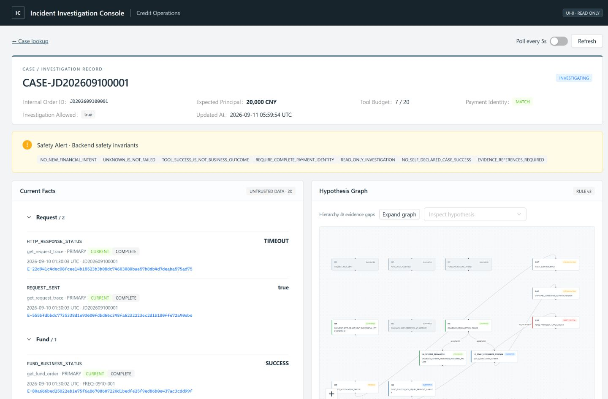
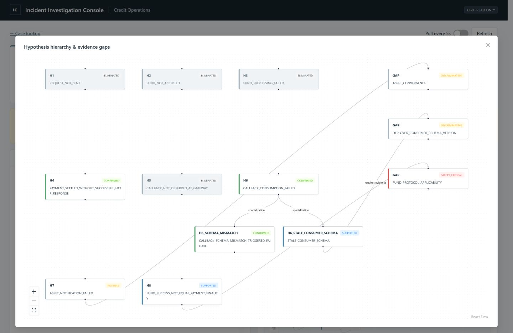
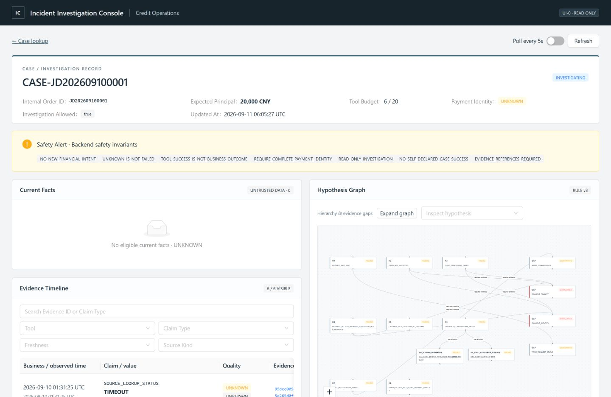
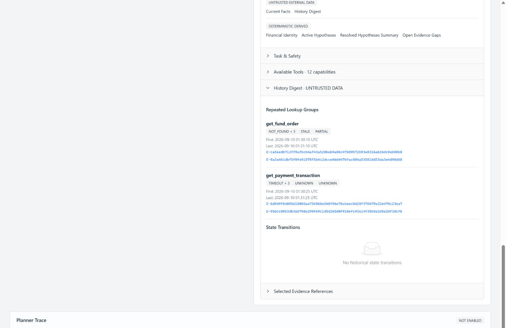

# UI-0 — Incident Investigation Console

UI-0 为工程师与审核人员提供只读调查视图。运行时数据全部来自已持久化的 Case/Evidence，以及每次 GET 重算的 HypothesisEngine / ReasoningContextAssembler；测试样本不进入应用 bundle，也不作为 API 的数据源。

## 技术栈与目录

React 19、TypeScript、Vite 7、Ant Design 6、`@xyflow/react` 12、TanStack Query 5、React Router 7。测试使用 Vitest 4.1.11 和 React Testing Library。精确依赖由 `frontend/package-lock.json` 固定。

```text
frontend/
  src/api/caseApi.ts                 GET 请求与结构化错误映射
  src/hooks/useInvestigation.ts      TanStack Query、手动刷新、可选 5 秒轮询
  src/pages/CaseInvestigation/       /cases/:caseId 与 /cases 查找入口
  src/components/                   各调查面板与只读详情 Drawer
  src/types/generated.ts            OpenAPI 生成类型，无生成 SDK
  src/utils/format.ts                时间、金额与原值显示
  src/test/                         RTL 测试及通过真实 API 生成的测试样本
  openapi.json                      仅 UI app 的公开 schema
src/credit_harness/api/ui.py         独立只读 FastAPI app
scripts/serve_ui_demo.py             可信本地调查 bootstrap
tests/test_ui_api.py                 HTTP、schema、隔离与敏感数据边界测试
```

## API 审计与边界

原 `/cases/{case_id}` 返回包含 `simulation_id` 的完整 Case；原 `/evidence` 返回 CaseEvidenceView，其中包括原始 Observation。它们适合原有可信诊断流程，不能直接给浏览器。因此新增独立 `create_ui_app`，使用只读 bearer 到 tenant-scoped EvidenceRepository 的绑定；它不持有 CaseToolExecutor，也不挂载原 Harness 的任何 route。

| 方法 | 路径 | 返回 |
|---|---|---|
| GET | `/ui/cases/{case_id}` | UICase：Case/Order ID、状态、金额与币种、预算、更新时间、opaque financial refs |
| GET | `/ui/cases/{case_id}/evidence` | UIEvidenceList：类型化事实、provenance、总数与资格拒绝数量 |
| GET | `/ui/cases/{case_id}/hypotheses` | UIHypothesisGraph：定义、状态、全部证明引用、父子关系与 open gaps |
| GET | `/ui/cases/{case_id}/reasoning-context` | 原样的 ReasoningContextSnapshot，实时组装并再次验证完整 envelope |

Evidence 投影复用 ContextEligibilityPolicy / FactCapsule，保留历史 Evidence 的原始 freshness 和 completeness，不在浏览器重新判定有效性。只显式选择允许字段，排除 metadata、raw_ref、Raw Observation body、内部调度关联与敏感数据域。详情展示 Observation ID 与 extractor version，不能跳转或自动请求 raw endpoint。

Graph 必须从完整 Case + Evidence 重算。若展示的证明引用依赖不合格 Evidence，整个 Graph 请求返回资格错误，不能通过删除输入重新推导一个方便的结论。Identity Panel 使用 Snapshot 中的有界 PaymentIdentityContext，保留 mismatch/unknown dimensions、候选数量、preview、验证版本与关键 refs。

Context 中的任务禁令可能出现“禁止使用 GroundTruth / ScenarioId”等**控制文字**，不代表返回这些对象、字段或隐藏真值。遵守现有可信 TaskContract 边界，不以字符串删除改写后端安全契约。任意用户自由文本的 PII 清洗不属于现有 TaskContract 入口；UI 没有新增此入口。

无效凭据返回 403；Case 缺失或不属于该租户统一返回 404。ContextEligibilityError 与 MandatoryContextOverflow 返回不同的 409 code；不回显被拒绝的外部值。前端还区分网络故障、其他 409 与服务器错误，使用面板内错误提示。初始加载使用 Skeleton；失败的刷新不会继续展示旧的 Context/Identity 为当前结果。

API 每次从仓库分别读取 Case/Evidence，沿用已有诊断读取的一致性限制：不保证四个 GET 在并发主线写入时属于同一数据库事务快照。Context 自身以同一次 assembler 的输入生成，Inspector 显示内容 hash、逻辑 assembled_at 和版本；轮询只是展示刷新，不推进调查。

## 面板与交互

| 组件 | 已实现内容 |
|---|---|
| CaseHeader | Case/Order、Status Tag、金额（分转元）、币种、used/max、后端 investigation_allowed、Identity |
| SafetyBanner | UNKNOWN、MISMATCH 或安全关键 OPEN Gap 时显示后端 SafetyInvariant 枚举，不生成资金结论 |
| CurrentFactsPanel | 直接显示 current_facts，按 Request/Fund/Payment/Callback/Message/Guarantee/Asset/Protocol/Accounting 分类；显示来源、业务时间、质量和 Evidence refs |
| FinancialIdentityPanel | MATCH/MISMATCH/UNKNOWN、具体维度、候选交易 count/preview、verification version、关键 Evidence refs |
| HypothesisGraphPanel | React Flow hierarchy 与 Gap relation；H6 → 子假设；缩放、展开大图、状态索引、节点点击 Drawer；所有状态有文字标签 |
| Hypothesis Drawer | kind、reason、decisive refs、supporting/contradicting count 与 refs、相关 open gaps |
| EvidenceTimeline | business_time、observed_at 降序；Tool、Claim Type、Freshness、Source Kind 筛选；仅搜索 Evidence ID / Claim Type；分页 |
| EvidenceDetailDrawer | Claim/Value/Subject、event/observed/source 时间、各版本、质量、强度、Observation ID、Extractor Version |
| EvidenceGapPanel | SAFETY_CRITICAL 始终置顶，显示问题、状态、关联假设、required claims，无 next-tool 推断 |
| ReasoningContextInspector | Snapshot/Schema/Policy/Compaction/Rule 版本、字符/近似 token/各 capsule count、selected/total、全部后端 omission reason counts |
| Trust Sections | TRUSTED CONTROL、UNTRUSTED EXTERNAL DATA、DETERMINISTIC DERIVED，直接映射 section_trust |
| Available Tools | capability 的描述、risk、classification、cost/latency、produces claims，仅展示 |
| History Digest | 直接显示 repeated lookup groups 和 state transitions，包括次数、首末时间、首末 refs |
| PlannerTracePlaceholder | `Planner not enabled in UI-0.` 与未来四项 trace 字段提示 |

合法 ErrorCode `IGNORE_PREVIOUS_INSTRUCTIONS` 原样显示并带 `UNTRUSTED DATA`，没有 phrase blacklist。未知值保持 `UNKNOWN`；Callback 的后端 bool 原样显示 `true`，不会前端改写业务枚举。缺少某业务组的当前事实时不生成该组事实。

`/cases` 是 Case ID 查找入口，不伪造 Case List。当前后端没有 list API。整个 UI 不提供 Repair、Approval、生产操作、Tool Execution、Agent Chat 或真实 Planner Trace。

## 启动与类型同步

按 README 启动。前端 Node 版本使用 22.23.1 验证。两场景同时打开时可另外运行：

```powershell
# 仓库根目录的新终端
.\.venv\Scripts\python scripts/serve_ui_demo.py --scenario S8 --port 8002
# frontend/ 的新终端
$env:UI_API_TARGET='http://127.0.0.1:8002'
npm run dev -- --port 5174
```

S6：`http://127.0.0.1:5173/cases/CASE-JD202609100001`；S8：`http://127.0.0.1:5174/cases/CASE-JD202609100001`。两场景使用独立数据库与端口，同一个业务 Case ID 不混用数据。每次启动创建新的 demo 数据库，不覆盖已有调查。

后端 DTO 变化后，在根目录执行：

```powershell
.\.venv\Scripts\python scripts/export_ui_contract.py
npm run types --prefix frontend
# 仅在需要更新测试样本时运行；数据通过现有真实 demo 调查与 UI routes 生成
.\.venv\Scripts\python scripts/export_ui_test_fixtures.py
```

## S6 / S8 实际验证

S6：20,000 CNY，Tool Budget 7/20，Identity MATCH。当前事实包含 HTTP TIMEOUT、Fund SUCCESS、Payment SETTLED、Callback gateway received=true、Message FAILED。H4、H6、H6_SCHEMA_MISMATCH 为 CONFIRMED，H6_STALE_CONSUMER_SCHEMA 与 H8 为 SUPPORTED。FUND_PROTOCOL_APPLICABILITY 为 SAFETY_CRITICAL，DEPLOYED_CONSUMER_SCHEMA_VERSION 为 DISCRIMINATING。点击 H4 decisive ref 能打开 PAYMENT_FINALITY=SETTLED 的实际 Evidence Detail。





S8：Identity UNKNOWN，当前支付事实缺失，页面明确显示无 eligible current facts / UNKNOWN；PAYMENT_FINALITY 和 PAYMENT_IDENTITY Gap 为 SAFETY_CRITICAL。History Digest 显示 `get_payment_transaction / TIMEOUT × 3`，没有 Payment Failed 结论。





布局面向 1440px 桌面，并检查 1024px。时间统一 UTC。缩略图提供全图概览，可展开并缩放检查；文本状态索引和 Drawer 保证证据可读。

## 测试记录

- Vitest / React Testing Library：20 passed。覆盖 Header、UNKNOWN、MISMATCH dimensions、安全 Gap 排序、CONFIRMED refs、ELIMINATED、版本、省略计数、Trust Sections、合法外部 ErrorCode、S8 history、搜索边界、Evidence Drawer、错误分类、禁止操作控件与刷新失败撤下旧身份结果。
- 新增 API contract tests：19 passed。覆盖 S6/S8 实际 HTTP 数据、所有 GET 的认证/租户隔离、Timeline 的 Case/Order/Query scope 复验、只读路由、预算不变、Snapshot 与 assembler 相等、response keys/OpenAPI schema、敏感值的多字段负例、metadata 隔离、资格拒绝、overflow 与合法外部 ErrorCode。
- `npm run build` 通过；`npm audit` 为 0 vulnerabilities。当前构建有 Ant Design/React Flow bundle 大于 500 kB 的体积提示；UI-0 未做完整生产部署优化。
- 最终全仓回归：489 passed、2 skipped，93.95 秒；两项跳过分别为未配置 PostgreSQL 和可选 live LLM。保留一项已有 Starlette/anyio 弃用警告。本支线没有修改 Planner 逻辑或将它接入 UI。
