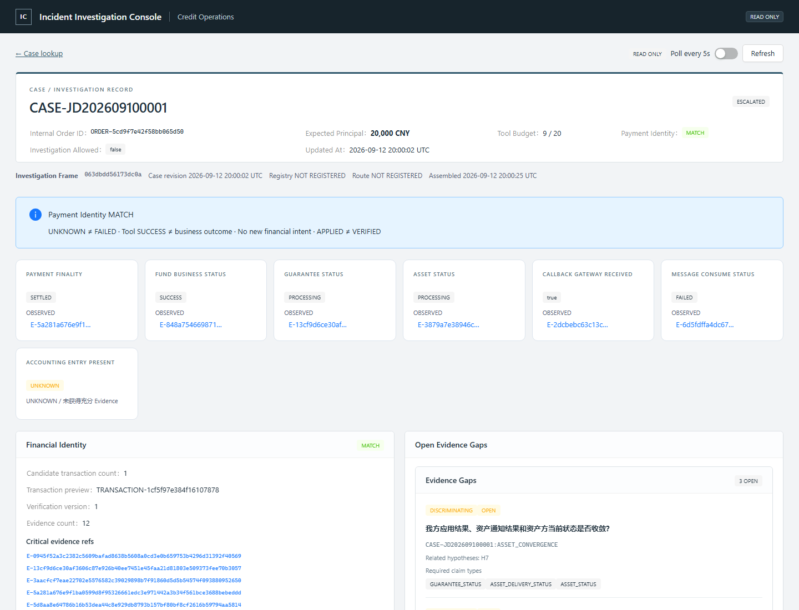
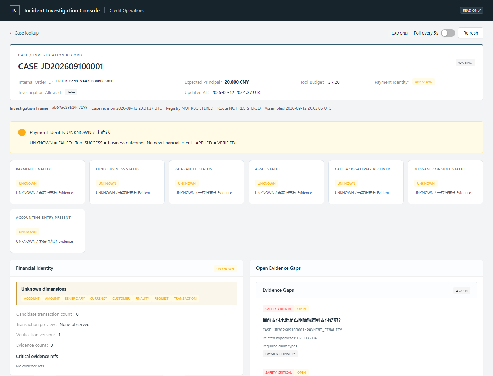

# Production Investigation & Trace Console — Step 16

这是面向工程师的只读调查控制台。当前数据全部为 synthetic fixtures；企业系统名称只来自已发布 Registry 的受控人类投影。页面不持有上游 Tool credential、执行客户端、审批授权或关闭 Case 的能力。

## 一次刷新，一个 InvestigationFrame

首页只请求 `GET /ui/cases/{case_id}/frame`。Frame 包含 case_revision、evidence_fingerprint、registry_version、route_revision、latest_agent_run、assembled_at、frame_id。Case revision 使用既有单调 updated_at；frame_id 还绑定所有 Trace 水位，因此只新增 Recovery/Registry/Work 记录也会改变 Frame。

后端在一个 SQLAlchemy Connection/Session 中读取完整输入：PostgreSQL 使用 REPEATABLE READ；SQLite 显式 BEGIN，避免 legacy transaction control 对 SELECT 不开启事务的问题。Evidence 复用 read_verified_evidence，重查 dispatch correlation、Observation hash、原始确定性 extraction 与 origin 关系。原 Observation 在此边界内使用，不返回浏览器。

完成安全投影后，在新的数据库读事务中再次比较全量水位。Case、Evidence、call receipts、Registry head、Route head、Registry source version、Work、Effect、Recovery、Evaluation、Closure 或安全 Trace 发生变化，整帧重试；三次均不稳定返回 `409 FRAME_STALE`。不会将旧 Route 搭配新 Registry，或静默把旧 Evaluator 当新 Evidence 的评估。请求完成后的新事件属于下一次刷新；任何系统都不能把未来事件纳入已经完成的 HTTP 响应。

## 金融真相与证据

金融摘要直接从当前合格 Evidence 构造，保留冲突时 UNKNOWN/CONFLICT。缺少 Payment Evidence 时显示 UNKNOWN，不使用 Fund SUCCESS、Tool SUCCESS 或历史经验填补。支付 finality 与订单对应的 Payment Identity 是两个字段。

Identity 复用确定性 PaymentIdentityResult，展示金额、币种、请求、用户、收款主体、账户六个维度。MATCH 不是概率，也不赋予写操作权限。Raw PII 不进入 Frame；订单、外部 subject、借据/交易引用使用稳定散列别名。CUS/BEN/ACC 引用也采用保留类型前缀的显示别名，同一个原引用在同一类型内关联一致。数字金额仍是整数分。

Current Evidence 展示 claim/value、source kind/tool、business time、observed_at、source_as_of、freshness、completeness、Evidence refs。首页最多预览 100 条 current facts，公开 total；Evidence 列表和详情可继续查询。展示是 diagnostic/inspection view，不是 Planner Context，不会回传模型或写入 Evidence。

Hypothesis Graph 从完整同帧 Case + Evidence 重算，保留父子关系和支持/反对/decisive 引用。若 Graph 或 Identity 依赖不合格 Evidence，整个 Frame 拒绝，不能靠删除输入生成方便的结论。Gap 展示 priority、问题、required claims，以及当前 Registry 路由真正能提供的 capability；缺失、禁用、歧义或 scope 不匹配的数据源不会被静态 Tool 名称冒充。

## 统一时间线与 Trace

统一 DTO 是 TraceItem(kind, status, occurred_at, fields, evidence_refs, related_refs, warning, historical)。fields 只由专门投影选择，不执行通用 payload dump。

| 区域 | 展示的数据 | 不能推导的结论 |
|---|---|---|
| Planner | Snapshot、候选、target gaps、claims、简短 rationale、拒绝码、离散排名、selected | 模型建议不等于授权 |
| Tool | call sequence、状态、真实 Observation status、observed_at、产生的 Evidence | Tool SUCCESS 不等于业务成功 |
| Registry Source | 实际 dispatch 的 system/code/display name/capability/channel/version/authority | Registry 权威等级不替代资金契约 |
| Route | revision、parent、protocol、变更原因及 supporting Evidence | UI 不能修改 Route |
| Knowledge | 检索空间别名、candidate/rerank 数、latency、degradation、skill/experience refs | Historical guidance 不是 Current Evidence |
| Work | type、status、reason、trigger、not_before、attempt、verification requirements | 展示不触发 claim/resume |
| Effect | action、approval state、ledger status | APPLIED ≠ VERIFIED |
| Recovery | status、attempt、next eligible、operator escalation | UNKNOWN 不允许盲目重试 |
| Evaluator | 八个维度、PASS/FAIL/INCONCLUSIVE/NOT_APPLICABLE、缺失 requirements | 旧评估不能批准新状态 |
| Closure | 实际 closure alias、report alias、outcome、closed_at | Agent 不能宣布关闭 |

旧 CaseCall 没有 dispatch timestamp。界面明确显示未记录；Observation 时间单独展示，绝不伪造 dispatch 时间。没有运行/检索/审批记录时显示“未记录”，不会模拟一条成功记录填满面板。

Evaluator 报告重验类型、内容 identity 和 tenant/case 绑定。Evidence/case revision/call history/effects 不再匹配的报告标为 historical，仍保留历史审计价值。CLOSED_VERIFIED 只在 Case 状态、持久化 CaseClosureRecord、实际 PASS 报告与 Evidence fingerprint 对应时展示，并标注 IndependentEvaluator PASS + VerifiedClosure CAS。

## 普通 Agent 与 Knowledge Trace 持久化

既有 orchestration_agent_runs 可以直接投影。普通 InvestigationAgentRuntime 默认改为 SQLInvestigationTraceStore，仍保留原 in-process records 接口；数据库只保存安全投影，不存整个 AgentRunResult 的执行 precondition/lease 等内部字段。调用者显式注入其他 trace store 的行为保留。

SQLInvestigationTraceStore 提供 `record_planning(snapshot, decision, guidance)`、`record_retrieval(case_id=..., snapshot_id=..., telemetry=...)`、`record_guidance(snapshot, bundle)`。这些是可信基础设施接口，未注册 HTTP POST。新表为 investigation_safe_traces；已部署库可调用 store.create_schema() 做 additive bootstrap。

真实 hybrid telemetry 与所选 guidance 应在原调用处捕获，不能为了展示再执行一次 retrieval。可信配置示例：

```python
store = SQLInvestigationTraceStore(cases)
store.create_schema()
provider = TracedGuidanceProvider(hybrid.guidance_provider(), store, hybrid=hybrid)
planner = PlannerService(model, guidance_provider=provider)
```

Skill 展示实际选择的 ID/version、strategies/invariants；存在对应持久化 Skill definition 时重验 hash 并展示 applicable scope，否则标记 NOT_RECORDED。Experience 展示别名、outcome、similarity features、已观察模式、tool sequence、lessons。两者有明确组织/历史徽标，不包含源 Case/订单/历史 Evidence ID。没有接入 telemetry sink 的旧记录不会被追溯伪造。PII Vault、embedding vector、raw query text、API key、完整 Prompt、私有 CoT 和 raw callback 不在任何新 DTO 中。

## API、分页和权限

所有新端点都是 GET，不存在执行/修复/重试/审批/关闭按钮。

- `/ui/cases/{case_id}/frame`：同帧首页。
- `/ui/cases/{case_id}/evidence-page`：Evidence cursor page。
- `/ui/cases/{case_id}/evidence-items/{evidence_id}`：同 Frame 的单条安全详情。
- `/ui/cases/{case_id}/{timeline|planner-runs|tools|sources|routes|knowledge|work|effects|recovery|evaluations|closure}`：分区 cursor page。

分页必须携带 frame_id；游标以服务器私钥 MAC 绑定 Frame、section 和 offset。默认每页 40，最多 100；首页时间线先展示 10 条，当前事实预览最多 100。分页读取短期不可变安全投影，不重新拼接实时数据。默认缓存每 tenant-bound service 32 Frames、TTL 300 秒；失效返回 FRAME_EXPIRED，游标跨 section/篡改返回 INVALID_CURSOR。缓存页也重新校验 Case 访问权限。Tool → Evidence 使用 EvidenceOrigin 多对多关系，因此 Evidence 去重不会抹掉旧 Tool Call 的证明链。

CASE_VIEW、CASE_TRACE_VIEW、CASE_FINANCIAL_VIEW 是三个独立服务端权限。当前完整 Frame 包含三个域，要求三项均具备，缺少任意一项返回 403。Registry Admin 的角色/凭据没有隐式继承；跨租户 Case 返回同样的 404。legacy read bindings 是此前已经明确授权的 investigation-only grants，兼容映射为三项权限；部署可通过 create_ui_app(..., permissions=...) 显式提供权限映射。

兼容工厂 create_ui_app 保留旧 UI-0 四个 GET，供既有客户端/测试迁移。生产入口 create_production_ui_app 与新的演示服务不挂载它们，已授权浏览器也不能通过旧诊断接口绕过 Frame 的 alias/PII 投影。不要把兼容工厂直接当生产公开入口。浏览器代理只在开发服务器端注入 synthetic 本地只读 grant，token 不在应用 bundle 中；真实部署需替换为企业认证后的服务端 grant。

## 前端结构与运行

React / TypeScript / Ant Design / React Flow / TanStack Query。useInvestigation 只获取一个 Frame，整帧替换，frame_id 变化卸载旧分页状态；刷新失败撤下旧资金状态。统一时间线使用限高滚动区域；所有状态同时有文字，避免只依赖颜色。Evidence Drawer 从同 Frame 拉取跨页详情；不请求 Raw Observation。

```powershell
# 只有真实持久化手工调查样本
.venv/Scripts/python scripts/serve_ui_demo.py --scenario S6 --port 8016
# 或在启动只读服务器前，用已有 synthetic fake Agent 生成实际 Planner/Tool Trace
.venv/Scripts/python scripts/serve_ui_demo.py --scenario S6 --recorded-agent --port 8016
# S8 可使用独立端口/数据库启动
# frontend 工作目录
$env:UI_API_TARGET='http://127.0.0.1:8016'
npm run dev -- --port 5176
```

生产路由 `/cases/CASE-JD202609100001`。启动阶段的 synthetic bootstrap 与只读 Web app 分离，网页访问/刷新本身绝不推进 Agent。

类型和样本同步：`scripts/export_ui_contract.py` → `npm run types --prefix frontend`；`scripts/export_ui_test_fixtures.py` 通过真实 API 生成前端测试 fixtures，应用 bundle 不引用 fixtures。

## 生产边界与验收

本步没有新 Agent/Planner/执行/审批能力，没有 MoneyMovement，没有修改金融安全策略。这里实现的是独立只读 Projection，不是数据库原始内容展览。

当前 Frame cache 是进程内短期缓存；多副本部署需要会话粘连或受保护的共享投影缓存，不能绕过 Frame token 改成各面板独立 GET。Frame 组装为正确性读取完整 Evidence provenance，返回内容有界；超大 Case 后续可优化读模型/索引，不能用截断输入改变金融判断。展示散列别名和敏感格式拦截不是完整 DLP/企业脱敏平台，输入数据仍必须遵守已有 synthetic/tokenized DTO 边界。

测试覆盖真实 S6/S8、并发 Evidence/Route/Registry 变化、历史报告失效、来源绑定、独立权限、分页 MAC、资金 UNKNOWN、Effect/Recovery、真实 VerifiedClosure，以及前端只读行为和刷新失败。详细数量以本步最终测试输出为准；历史 UI-0 的 489 项结果不再代表当前仓库。

## 真实 Synthetic Agent Frame 示例

`scripts/export_investigation_frames.py` 运行已有 Fake Agent 并通过只读 API 导出，下面不是手写前端 mock：

- [S6 Frame](examples/step16-s6-frame.json)：ESCALATED、Identity MATCH、Payment SETTLED、30 条 Evidence、9 次 Tool Call。H4/H6/H6_SCHEMA_MISMATCH CONFIRMED；部署版本等缺口仍存在，不伪造闭环。
- [S8 Frame](examples/step16-s8-frame.json)：WAITING、Identity UNKNOWN、Payment UNKNOWN、3 条查询结果 Evidence、3 次 Tool Call，没有 CLOSED_VERIFIED。

这两个基础演示沿用未绑定企业 Registry 的 synthetic 配置，因此 Header 明确显示 NOT REGISTERED；Registry 来源和协议 Route revision 由注册场景的真实集成测试另行验证。





## 本次验证结果

| 验证 | 实际结果 |
|---|---|
| SQLite 全仓回归 | 1457 passed / 8 skipped，704.95 秒 |
| PostgreSQL 全仓回归 | 1459 passed / 6 skipped，621.22 秒 |
| 后续最终 Frame/Trace/生产入口补丁 + 兼容 UI API | SQLite 60 passed；PostgreSQL 60 passed |
| 检索 telemetry 隔离相关回归 | SQLite 83 passed / 4 skipped；PostgreSQL 84 passed / 3 skipped |
| 前端 Vitest / RTL | 46 passed |
| TypeScript + Vite production build | 通过 |
| 浏览器 | 已检查 1440px S6/S8 实际截图 |

全量回归之后补充了去重 EvidenceOrigin、检索早期失败隔离、Recovery 水位和生产入口隔离，以上单独列出的是对应增量验证，不把它们冒充另一次全仓运行。数据库跳过项为未显式配置的真实模型/embedding/公司文件，以及 SQLite 下 PostgreSQL 专属测试。保留上游 Starlette/AnyIO 弃用提示、jsdom CSS 解析提示与已有 Vite 大 bundle 提示；未调用真实 LLM 或访问真实个人/金融数据。
